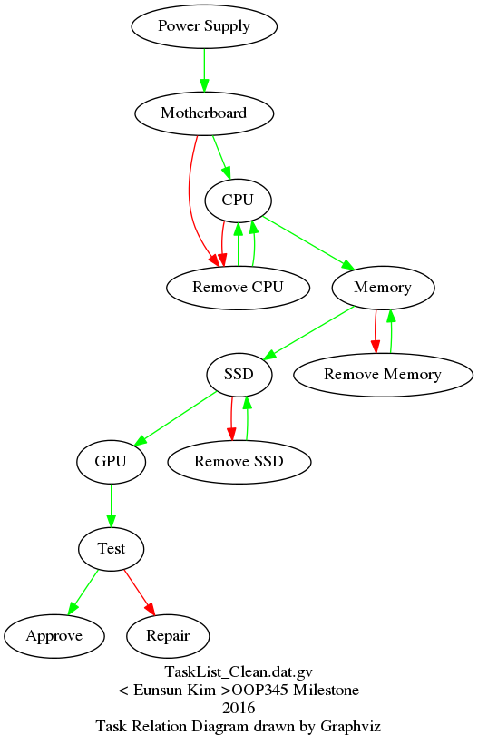
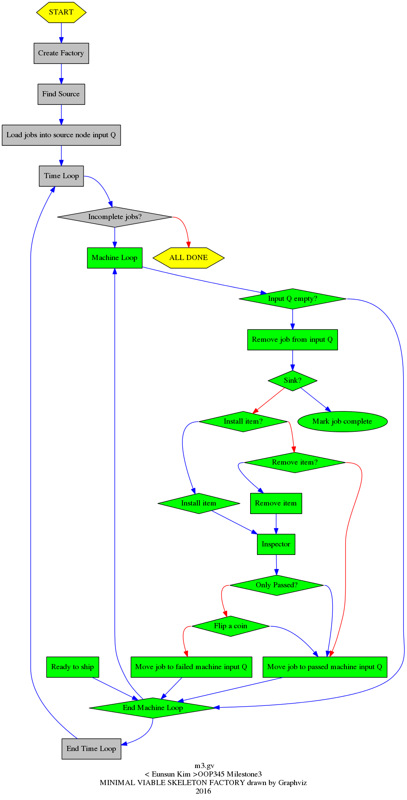

## Based on the OOP345 final project

### These C ++ project simulates an assembly line, which fulfils customer orders using processors that perform tasks of adding and removing specific items according to customer specifications and quality control inspections.

* runtime versions C++, C++11, C++14

+ Component

   [1] CSV file reader  : read each of the three types of project website task, item, and customer order data files.

   [2] Task Parser : task data optionally have 1, 2, 3, or 4 data fields: 'name', 'slots', 'passed', 'failed'.

   [3] Item Parser : An item has either 4 or 5 fields: 'item name', 'installer task', 'remover task', 'sequential code', optional 'description'
   
   [4] Customer Order Parser : A customer order record must have at least three fields, a customer name and a product name followed by a variable number of items.
   
   [5] Factory
   
   [6] Job
   
   [7] Machine
   
   [8] Expected Output img.
   
     
  
   
   
   
   
   
   
   
   
   
      
    
